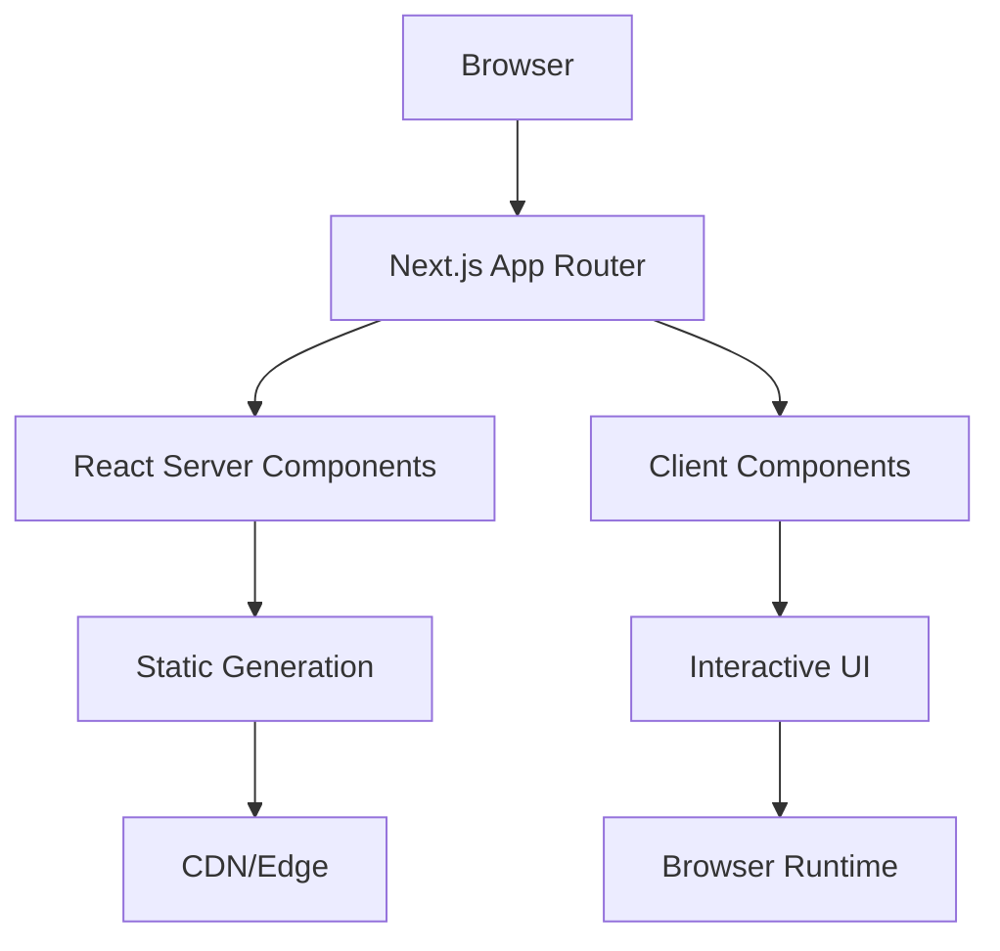
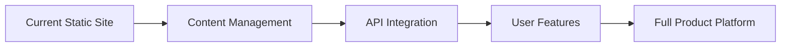

# NUU Cognition Website - Brownfield Architecture Documentation

## Table of Contents
1. [Executive Summary](#executive-summary)
2. [Current State Analysis](#current-state-analysis)
3. [Technology Stack](#technology-stack)
4. [Architecture Overview](#architecture-overview)
5. [Technical Debt & Constraints](#technical-debt--constraints)
6. [Migration Opportunities](#migration-opportunities)
7. [Performance & Scalability](#performance--scalability)
8. [Security Considerations](#security-considerations)
9. [Development Practices](#development-practices)
10. [Future State Architecture](#future-state-architecture)

## Executive Summary

The NUU Cognition website is a Next.js 15 application built with TypeScript and React 19, representing a modern web architecture for a cognitive augmentation software company. The current implementation follows a minimalist design philosophy with a focus on clarity and performance.

### Key Findings
- **Framework**: Next.js 15 with App Router (modern architecture)
- **State**: Early-stage implementation with clean codebase
- **Design**: Mature design system documented but partially implemented
- **Testing**: No test infrastructure currently in place
- **Content**: Mixed static/dynamic content strategy emerging

## Current State Analysis

### Repository Structure
```
nuu-website/
├── src/
│   ├── app/              # Next.js App Router pages
│   ├── components/       # React components
│   └── lib/             # Utilities
├── docs/                # Documentation
├── public/              # Static assets
└── [config files]       # Various configuration
```

### Architectural Patterns Identified

1. **Component Architecture**
   - Minimal component library with UI primitives
   - Using shadcn/ui pattern for component development
   - Clear separation between UI components and page components

2. **Routing Strategy**
   - App Router for modern React Server Components
   - File-based routing with TypeScript
   - Static pages for main content

3. **Styling Approach**
   - Tailwind CSS for utility-first styling
   - CSS-in-JS avoided for performance
   - Design tokens partially implemented

4. **Content Management**
   - MDX support configured but not actively used
   - Static content in pages
   - No CMS integration

## Technology Stack

### Core Technologies
- **Runtime**: Node.js
- **Framework**: Next.js 15.1.4
- **Language**: TypeScript 5
- **UI Library**: React 19
- **Styling**: Tailwind CSS 3.4.1
- **Package Manager**: npm

### Key Dependencies
- **UI Components**: 
  - Radix UI (accessible component primitives)
  - Lucide React (icon library)
  - class-variance-authority (component variants)
- **Content**:
  - MDX support (@mdx-js/loader, @next/mdx)
  - next-mdx-remote (dynamic MDX)
  - gray-matter (frontmatter parsing)
- **Utilities**:
  - clsx & tailwind-merge (className utilities)

### Development Dependencies
- ESLint with Next.js config
- PostCSS for Tailwind processing
- TypeScript with strict mode enabled

## Architecture Overview

### Application Architecture



### Component Hierarchy

```
Layout (Server Component)
├── NavigationMinimal (Client Component)
├── Page Content (Server/Client Mixed)
└── FooterMinimal (Client Component)
```

### Data Flow
- Currently static with no external data sources
- No state management library (appropriate for current scale)
- Local component state for UI interactions

## Technical Debt & Constraints

### Identified Issues

1. **Testing Infrastructure**
   - No unit tests
   - No integration tests
   - No E2E test setup
   - Risk: Regressions as codebase grows

2. **Build & Development**
   - Using Turbopack (experimental)
   - No CI/CD pipeline configured
   - No automated deployment

3. **Documentation**
   - Good design system docs but implementation gaps
   - No API documentation (as no APIs yet)
   - No contributor guidelines

4. **Performance**
   - No performance monitoring
   - No Core Web Vitals tracking
   - No bundle size optimization strategy

5. **Accessibility**
   - Using Radix UI (good foundation)
   - No automated accessibility testing
   - No WCAG compliance verification

### Technical Constraints

1. **Next.js App Router**
   - Newer paradigm, less community resources
   - Server Components complexity
   - Potential hydration issues

2. **React 19**
   - Bleeding edge version
   - Potential stability concerns
   - Limited third-party compatibility

## Migration Opportunities

### Short-term (1-3 months)

1. **Testing Strategy**
   ```typescript
   // Recommended stack
   - Vitest for unit tests
   - React Testing Library
   - Playwright for E2E
   ```

2. **Content Management**
   - Implement MDX for blog/documentation
   - Consider headless CMS for dynamic content
   - Structure content types

3. **Component Library**
   - Complete shadcn/ui integration
   - Build remaining design system components
   - Create Storybook for component documentation

### Medium-term (3-6 months)

1. **Performance Optimization**
   - Implement monitoring (Vercel Analytics/Sentry)
   - Image optimization strategy
   - Code splitting for tools pages

2. **SEO & Marketing**
   - Structured data implementation
   - Meta tag management system
   - Analytics integration

3. **Developer Experience**
   - Set up CI/CD pipeline
   - Automated testing in PR process
   - Documentation generation

### Long-term (6-12 months)

1. **Product Integration**
   - API routes for product features
   - Authentication system
   - User dashboard architecture

2. **Scalability**
   - Database integration planning
   - Caching strategy
   - Edge function utilization

## Performance & Scalability

### Current Performance Profile
- Static site generation for most pages
- No database queries
- Minimal JavaScript bundle
- Fast initial load times

### Scalability Considerations

1. **Horizontal Scaling**
   - Stateless architecture ready for scaling
   - CDN-friendly static pages
   - No session management complexity

2. **Future Bottlenecks**
   - Content management at scale
   - User-generated content handling
   - API rate limiting needs

### Optimization Opportunities
```typescript
// Recommended optimizations
- Dynamic imports for heavy components
- Image optimization with next/image
- Font optimization with next/font
- Progressive enhancement strategy
```

## Security Considerations

### Current Security Posture
- No authentication system
- No user data handling
- Static content only
- HTTPS enforced (assumed with modern hosting)

### Security Recommendations

1. **Dependencies**
   - Regular dependency updates
   - Security audit automation
   - License compliance checking

2. **Future Considerations**
   - CSP headers implementation
   - CORS policy definition
   - API security planning

## Development Practices

### Code Organization
```typescript
// Current patterns
- Functional components only
- TypeScript for type safety
- Consistent file naming
- Clear component boundaries
```

### Recommended Practices

1. **Code Quality**
   - Pre-commit hooks (Husky)
   - Automated formatting (Prettier)
   - Linting rules enforcement
   - Type checking in CI

2. **Documentation**
   - JSDoc for complex functions
   - README for each major feature
   - Architecture Decision Records (ADRs)

3. **Version Control**
   - Feature branch workflow
   - Conventional commits
   - PR templates
   - Protected main branch

## Future State Architecture

### Recommended Evolution Path



### Phase 1: Enhanced Content (Months 1-3)
- MDX-based blog/documentation
- Search functionality
- Newsletter integration
- Analytics implementation

### Phase 2: API Foundation (Months 3-6)
- Next.js API routes
- Database integration (PostgreSQL recommended)
- Authentication system
- Basic user features

### Phase 3: Product Integration (Months 6-12)
- Product dashboard
- User workspaces
- Payment integration
- Advanced features

### Technical Stack Evolution

```yaml
Current:
  - Next.js + React
  - Tailwind CSS
  - Static hosting

Future:
  - Next.js + React (maintained)
  - Tailwind CSS (maintained)
  - PostgreSQL/Supabase
  - Redis for caching
  - Stripe for payments
  - Analytics platform
  - Error tracking
  - Performance monitoring
```

## Action Items

### Immediate (This Sprint)
1. Set up basic test infrastructure
2. Implement missing design system components
3. Create CI/CD pipeline
4. Add error boundary components

### Next Month
1. Implement content management strategy
2. Add performance monitoring
3. Complete accessibility audit
4. Set up development documentation

### Quarterly Goals
1. Launch blog/documentation section
2. Implement user authentication
3. Create component library documentation
4. Establish API architecture patterns

## Conclusion

The NUU Cognition website has a solid foundation with modern technologies and clean architecture. The main challenges are typical of early-stage projects: missing testing, incomplete feature implementation, and preparation for scale. The recommended path forward focuses on establishing robust development practices while incrementally adding features to support the company's growth from static website to full product platform.

The architecture is well-positioned for evolution, with no major refactoring needed. The key is to maintain the current clean structure while adding the necessary infrastructure for a production-grade application.