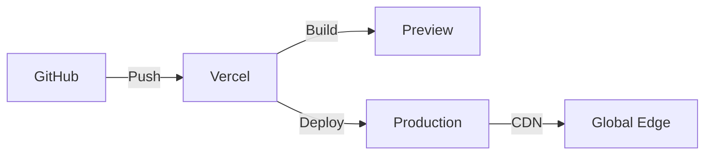

# Deployment Strategy & Infrastructure

## Current State

### Deployment Method
- Likely manual or via Vercel (based on Next.js defaults)
- No CI/CD pipeline configured
- No deployment documentation

### Infrastructure
- Static site capabilities
- No database
- No backend services
- CDN via hosting provider

## Recommended Deployment Architecture

### Short-term: Vercel Deployment



**Benefits**:
- Zero configuration
- Automatic previews
- Built-in analytics
- Optimized for Next.js

**Setup**:
```bash
# Install Vercel CLI
npm i -g vercel

# Deploy
vercel

# Production deployment
vercel --prod
```

### Medium-term: Enhanced Pipeline

```yaml
# .github/workflows/deploy.yml
name: Deploy
on:
  push:
    branches: [main]
  pull_request:
    branches: [main]

jobs:
  test:
    runs-on: ubuntu-latest
    steps:
      - uses: actions/checkout@v3
      - uses: actions/setup-node@v3
      - run: npm ci
      - run: npm test
      - run: npm run lint
      - run: npm run typecheck

  deploy:
    needs: test
    if: github.ref == 'refs/heads/main'
    runs-on: ubuntu-latest
    steps:
      - uses: actions/checkout@v3
      - uses: vercel/action@v3
        with:
          vercel-token: ${{ secrets.VERCEL_TOKEN }}
```

## Environment Strategy

### Environment Structure
```
Production (main branch)
├── app.nuu.com
├── Production database
└── Production APIs

Staging (staging branch)
├── staging.nuu.com
├── Staging database
└── Staging APIs

Development (feature branches)
├── preview-*.vercel.app
├── Development database
└── Mock APIs
```

### Environment Variables
```env
# .env.local (development)
NEXT_PUBLIC_API_URL=http://localhost:3001
DATABASE_URL=postgresql://localhost/nuu_dev

# .env.production
NEXT_PUBLIC_API_URL=https://api.nuu.com
DATABASE_URL=${{ secrets.DATABASE_URL }}
```

## Infrastructure Evolution

### Phase 1: Static Site (Current)
```
Vercel
├── Static hosting
├── Edge functions
├── Analytics
└── Web Vitals
```

### Phase 2: Full-Stack Application
```
Vercel + Supabase/Planetscale
├── Next.js application
├── API routes
├── PostgreSQL database
├── Redis cache
└── Object storage
```

### Phase 3: Microservices Architecture
```
Multi-Service Deployment
├── Web (Vercel)
├── API (Railway/Render)
├── AI Services (Modal/Replicate)
├── Database (Planetscale)
├── Cache (Upstash)
└── Queue (Inngest)
```

## Monitoring & Observability

### Essential Monitoring Stack

1. **Application Monitoring**
   - Vercel Analytics (built-in)
   - Sentry for error tracking
   - LogRocket for session replay

2. **Performance Monitoring**
   ```typescript
   // lib/monitoring.ts
   export function reportWebVitals(metric: NextWebVitalsMetric) {
     // Send to analytics
     window.gtag('event', metric.name, {
       value: Math.round(metric.value),
       metric_id: metric.id,
       metric_value: metric.value,
       metric_delta: metric.delta,
     })
   }
   ```

3. **Uptime Monitoring**
   - Better Uptime or Checkly
   - API endpoint monitoring
   - SSL certificate monitoring

## Security Considerations

### Security Headers
```typescript
// next.config.ts
const securityHeaders = [
  {
    key: 'X-Frame-Options',
    value: 'SAMEORIGIN'
  },
  {
    key: 'X-Content-Type-Options',
    value: 'nosniff'
  },
  {
    key: 'Referrer-Policy',
    value: 'strict-origin-when-cross-origin'
  },
  {
    key: 'Content-Security-Policy',
    value: ContentSecurityPolicy.replace(/\s{2,}/g, ' ').trim()
  }
]
```

### Secret Management
- Environment variables for secrets
- Vercel encrypted environment variables
- GitHub secrets for CI/CD
- Vault for future complex needs

## Deployment Checklist

### Pre-deployment
- [ ] Run tests locally
- [ ] Check TypeScript errors
- [ ] Verify environment variables
- [ ] Update dependencies
- [ ] Review security headers

### Deployment
- [ ] Deploy to staging first
- [ ] Run smoke tests
- [ ] Check monitoring dashboards
- [ ] Verify analytics

### Post-deployment
- [ ] Monitor error rates
- [ ] Check performance metrics
- [ ] Verify SEO/meta tags
- [ ] Test critical user paths

## Cost Optimization

### Current (Minimal Cost)
- Vercel Free/Pro tier
- No database costs
- No additional services

### Projected Growth Costs
```
Monthly Estimates:
- Hosting: $20-100 (Vercel Pro)
- Database: $25-100 (Planetscale)
- Monitoring: $15-50 (Sentry)
- CDN/Bandwidth: $0-50
Total: $60-300/month
```

### Cost Optimization Strategies
1. Use ISR instead of SSR where possible
2. Implement proper caching headers
3. Optimize images and assets
4. Use edge functions sparingly
5. Monitor and optimize database queries

## Disaster Recovery

### Backup Strategy
1. **Code**: Git (GitHub)
2. **Database**: Daily automated backups
3. **User uploads**: Object storage with versioning
4. **Configuration**: Version controlled

### Recovery Procedures
1. **Rollback**: Via Vercel dashboard or Git
2. **Database restore**: From automated backups
3. **Full recovery**: Infrastructure as Code

## Future Considerations

### Scaling Triggers
- 10k+ daily active users
- 100+ requests/second
- 1TB+ monthly bandwidth
- Global user base requiring geo-distribution

### Infrastructure Roadmap
1. **Q1**: Basic monitoring and CI/CD
2. **Q2**: Database and caching layer
3. **Q3**: Multi-region deployment
4. **Q4**: Microservices architecture